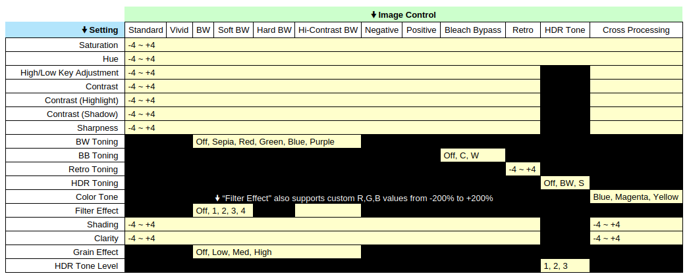

# Ricoh GR III Metadata Reverse Engineering

_My attempts at figuring out how to get settings from the Ricoh GR III's vendor-specific EXIF metadata; image control settings, crop modes, etc. None of this should be considered authoritative, these are essentially just research notes and hacked together configurations, but I figured they might be helpful to others._

---

If you've ever wanted to get all of the image control settings from the metadata of a Ricoh GR III photo, the files and information here should hopefully help.

## tl;dr

Save [`ExifTool_config`](ExifTool_config) as `~/.ExifTool_config`, then use this command to see all of the settings in the order they'd normally be shown in the camera. You can even define your recipes and have them show up too.

```bash
exiftool -GR3 <FILE>
```

Here's an example of the output,

```text
GR3 Crop Mode                   : L (28mm)
White Balance                   : Multi Auto
GR3 WB Shift Name               : A6
Peripheral Illumination Corr    : On
GR3 Highlight Correction        : Auto
Shadow Correction               : Normal
Sensitivity Adjust              : +0.7
Image Tone                      : Negative Film
GR3 Saturation                  : 2
GR3 Hue                         : 0
GR3 High Low Key                : 0
GR3 Contrast                    : 3
GR3 Contrast Highlight          : -4
GR3 Contrast Shadow             : -1
GR3 Sharpness                   : 1
GR3 Shading                     : 0
GR3 Clarity                     : 0
GR3 Recipe                      : Reggie's Color Negative
```

By having all of these fields available in `exiftool` they should also show up in any other software that uses it. For example, I have them shown in the Metadata sidebar in digiKam with a custom filter.

> [!TIP]
> If you don't want the configuration to always be used when running `exiftool` commands, you can save it as another file such as `gr3.config` and then use `exiftool -config gr3.config` when you do want to use it.

> [!NOTE]
> It is worth noting that I have absolutely no idea what I'm doing when it comes to ExifTool configuration files. I used the tried and true method of copy/pasting from documentation, changing some values, fixing any errors that showed up, and hoping for the best. I did discover `PrintConv` and updated everything to use that though. If you know what you are doing, don't hesitate to explain what I did wrong so I can learn. This is very much a "works on my machine" type of thing.

## Technical Details

### Pentax_0x0098

See [`Pentax_0x0098`](Pentax_0x0098.md). This field stores the "Crop Mode" and can be used to [uncrop a photo](Uncropping.md) to get the full image back if you accidentally shot at 35mm or 50mm instead of 28mm, etc. Not that I would ever do such a thing.

### Pentax_0x0247

See [`Pentax_0x0247`](Pentax_0x0247.md). This field stores all of the "Image Control" settings. Basically anything from the below settings matrix is encoded in the field. You can use this information to [automatically identify the recipe that was used](Recipe%20Identification.md).


